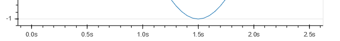
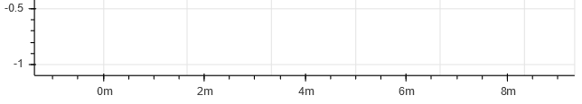

## Custom TimeAxis feature for [Bokeh 0.12.4](https://github.com/bokeh/bokeh/tree/0.12.4).

I made this custom [TimeAxis](https://github.com/Corleo/TimeAxis) based on DatetimeAxis to plot time measurements and to handle a problem with sub-seconds scales [I found in DatetimeAxis](https://github.com/bokeh/bokeh/issues/5444) by doing 2 things:
* Create subscales to reduce occurrence of 0 values to only one (Ex: between `nanoseconds` and `microseconds` there is `micronanosec`).
* Except for tick equal `0s`, when at some scale a tick value is 0 then this tick scale rises to next scale until reaching the top of the TimeAxis scale, which is the `hour`.

So for values `[0s, 0.5s, 1s, 1.5s, 2s, 2.5s]`, while DatetimeAxis displays them as:

```0ms 500ms 0ms 500ms 0ms 500ms```

TimeAxis displays them as:

```0.0s 0.5s 1.0s 1.5s 2.0s 2.5s```

And zooming around `2.0s` for exemple retuns values like:

```960ms 980ms 2s 20ms 40ms```

This way I can know that these values are relative to `2s`:
-  980ms **before reaching** 2s = 1.980s
- 20ms **after reaching** 2s = 2.020s


## Features

So this custom axis has the following features:
* The scales goes from `nanoseconds` to `hours` and between each scale there is a midle scale.
* Minimum tick interval is `1 nanosecond`.
* Except for tick equal `0s`, when at some scale a tick value is 0 then this tick scale rises to next scale until reaching the top of the TimeAxis scale.
* Sub-second scales are divided by 5 and the others by 4 (quarters).
* The base value for TimeAxis is second: value 3.5 will be interpreted as 3.5s, 0.0003 as 300us and so on.


## Setting custom axis

I couldn't find a proper way to set a custom axis. As a workaround I used the `add_layout` method and disabled the default axis with `x_axis_type=None` on `figure()`:

```python
p = figure(..., x_axis_type=None)
p.add_layout(TimeAxis(), 'below')
```

But this method don't set the axis correctly - it shows the scales but don't draws the xaxis.


So I tried to set `ticker` and `formatter` separately as follows:

```python
p = figure(..., x_axis_type='linear')
p.xaxis[0].ticker = TimeTicker()
p.xaxis[0].formatter = TimeTickFormatter()
```

But again the xaxis lines aren't being drawn correctly - they don't follow my custom ticks.



## Testing

    $ bokeh serve --show testTimeAxis.py
